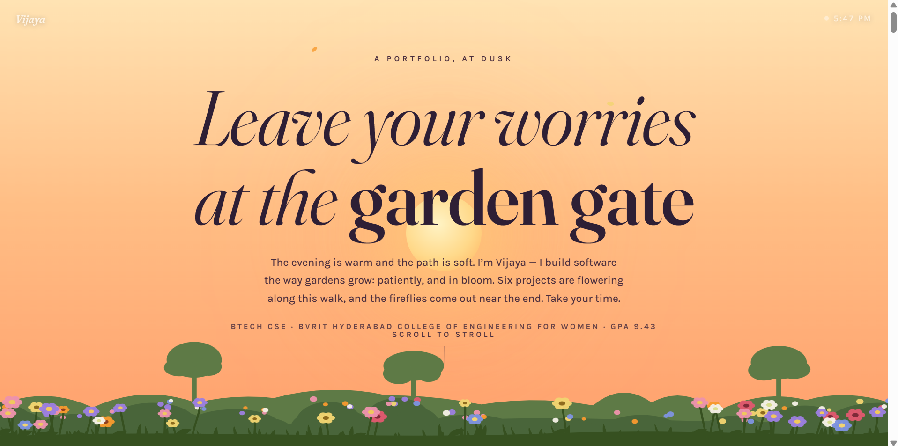
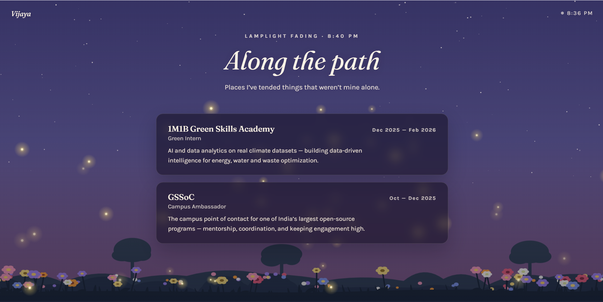

# Vijaya Y — Portfolio

One body of work, split three ways by nature — not by style.

**Live:** https://portfolio-zeta-gilt-26xhf2sai6.vercel.app/

- **`index.html`** — the Welcome page. Two portals: *Recruiters* go straight to the Studio (résumé) version; *everyone else* goes to the crossroads.
- **`roads.html`** — the crossroads. Choose Garden, Atlas, or Ocean.
- **`garden.html`** — *the Garden.* Colorful and illustrated. Holds the simpler, foundational projects: **Happy-Hive, StudyBase, Inkwell, Magic 8-Ball, Pet Simulator.**
- **`galaxy.html`** — *the Atlas.* Dark and animated. Holds the deeper, more technical projects: **Sourcerer, Waypoint, TechVest Agent, Slate, Semblance, Emotion-Cipher, Cultura**, plus a "deep field survey" of two more technical builds pulled in for a closer look (**CVD Simulator, Secret Scanner**) and two smaller minor-body projects (Trajectory, Cardsmith). Patents moved to Ocean, since Ocean now owns the credentials layer.
- **`ocean.html`** — *the Ocean / Deep Dive.* No projects at all. The fullest telling of the personal story — bio, skills, work experience, both filed patents, three flagship hackathon wins told in depth (CodeStorm 2026, Drishti-Ne/IIM Shillong, WebNova), and the rest of the competition record — as one continuous scroll from the surface to the Challenger Deep. Custom canvas ocean simulation, a live bathymetric depth gauge, optional ambient audio that shifts with depth.
- **`formal.html`** — *the Studio.* Plain and text-based — case studies, filed patents, and a recruiter-ready résumé.

### Flow

```
index.html (Welcome)
 ├── Recruiters this side  →  formal.html (Studio) — direct
 └── Everyone else         →  roads.html (crossroads)
                                ├── Garden   →  garden.html   (foundational projects)
                                ├── Atlas    →  galaxy.html   (deep/technical projects)
                                └── Ocean    →  ocean.html    (no projects — full personal
                                                                record: bio, patents,
                                                                hackathons, experience)
```

Garden and Atlas split the project catalog by nature, with zero overlap:
Garden gets the approachable/foundational builds, Atlas gets the technically
ambitious ones. Ocean isn't a third way to see the same projects — it's a
different kind of content entirely: the credentials layer.

---

### Preview




---

### Built with

- Vanilla JS, SVG & Canvas — flowers, foliage, fireflies, petals, the star
  field, and the ocean's entire underwater simulation (particles, creatures,
  caustics, god rays) are all generated in code, no image assets
- **GSAP** + **ScrollTrigger** — pinned animations and scroll-driven timelines (Garden, Atlas, Studio)
- **Lenis** — smooth scroll (Garden, Atlas, Studio)
- Ocean runs its own custom scroll-and-render engine — an inertially-smoothed
  scroll value drives a live canvas ocean, a bathymetric depth/pressure gauge,
  and optional Web Audio ambience that shifts with depth. No external
  animation libraries.
- The Welcome page (`index.html`) uses plain CSS animations only — kept light and fast as the true entry point
- No build step, no framework — plain HTML/CSS/JS files, one per page

Each page respects `prefers-reduced-motion`. Ocean additionally pauses its
render loop via the Page Visibility API while its tab isn't visible.

### Run locally

Just open `index.html` in a browser. That's it — no install, no build.

### Structure

```
index.html      Welcome page / entry point
roads.html      crossroads — choose Garden, Atlas, or Ocean
garden.html     Garden — foundational projects (illustrated)
galaxy.html     Atlas — deep/technical projects (animated)
ocean.html      Ocean — no projects; full personal record (bio, patents,
                 hackathons, experience)
formal.html     Studio — résumé-style, recruiter-facing
Resume.pdf      downloadable résumé, linked from every version
og-image.png    social preview image
sitemap.xml     for search engines
robots.txt      for search engines
screenshots/    README preview images
```

---

*Garden: Happy-Hive · StudyBase · Inkwell · Magic 8-Ball · Pet Simulator.
Atlas: Sourcerer · Waypoint · TechVest Agent · Slate · Semblance ·
Emotion-Cipher · Cultura · CVD Simulator · Secret Scanner · Trajectory ·
Cardsmith.
Ocean: no projects — patents, hackathons, and the full record instead.*